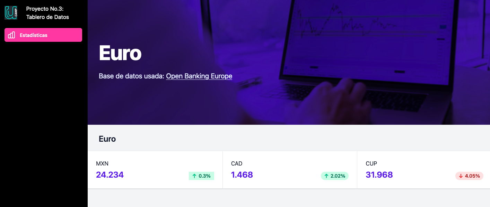

# PROYECTO 3: Tablero de Datos ("Dashboard")

## **ÍNDICE**

* [1. Intro](#1-intro)
* [2. Demo](#2-demo)
* [3. ¿Qué construirás?](#3-qu%C3%A9-construir%C3%A1s)
* [4. Objetivos de Aprendizaje](#4-objetivos-de-aprendizaje)
* [5. Requisitos](#5-requisitos-y-entregables)
* [6. Criterios de evaluación](#6-criterios-de-evaluaci%C3%B3n)
* [7. Entregas](#7-entregas)

****

## 1. Intro

Uno de los beneficios que profesionales en desarrollo pueden dar a sus equipos es la `comunicación de datos`.

El desarrollo de tableros es una constante en el mundo de proyectos de software. Es por ello, que están apareciendo los "dashboards" a través de servicios como Google Studio que te permiten integrar datos de manera efectiva.

Por ello, aprender a integrarlo en nuestras aplicaciones, ya sea para un usuario, un equipo o un "stakeholder", es un ejercicio sólido para practicar nuestras habilidades.

En este proyecto, trabajaremos con una librería de gráficas muy popular, llamada `Chart.js`. 

Adicionalmente, harás una conexión a través de un API a una base de datos controlada por un tercero. Una vez descargados los datos en nuestra aplicación podrás manipularlos para expresarlos como desees.

****

## 2. Demo

Puedes entrar a ver el demo en este vínculo: https://friendly-snyder-a2fba4.netlify.app

- En este ejemplo, observarás una conexión vía API a [fixer.io](https://fixer.io), el cual es un servicio API que ofrece en tiempo real el valor de una moneda con respecto a otras. Por lo tanto, la gráfica es real, establecida al día de hoy.

- Observa que tenemos estructurada la aplicación bajo la influencia del ambiente de desarrollo `Node.js`.

- Se utilizó asincronía para la recepción de datos y luego, la invocación del gráfico.

Puedes revisar el proyecto en la carpeta `demo`dentro de este repositorio.

****

## 3. ¿Qué construirás?

En este proyecto construirás una aplicación que consuma una API. Puede ser pública o privada.

Te recomendamos revisar este repositorio en GitHub para elegir un API que pueda ayudarte a desarrollar este proyecto: https://github.com/public-apis/public-apis

Estos son las características a considerar:

- Usar un ambiente de desarrollo con `Node.js`
- Utilizar [Chart.js](https://www.chartjs.org/) para el desarrollo de gráficas. En caso de quere utilizar una diferente, es posible.
- Realizar una conexión a una API externa para extraer datos. Opcionalmente, puedes utilizarla con una `API KEY`.

****

## 4. Objetivos de aprendizaje

- Crear un ambiente de desarrollo con `Node.js`
- Conocer el funcionamiento de las APIs
- Aplicar procesos síncronos y asíncronos en JavaScript

****

## 5. Requisitos y entregables

Usa esta lista para saber los requisitos mínimos del proyecto:

### GENERAL

- [ ] Realizarse en parejas (por motivos específicos, podría trabajarse individualmente).

### UI
- [ ] Aplicar HTML5
- [ ] Aplicar selectores en CSS.
- [ ] Sección de gráficos (`Chart.js` utiliza `canvas`)

### JAVASCRIPT

- [ ] Uso de `fetch` o `axios` para el consumo de datos
- [ ] Modularización con `import` y `export`
- [ ] Uso de promesas o `async-await`

### CONTROL DE VERSIONES
- [ ] Crear un repositorio en GitHub
- [ ] Realizar "commits" en tu repositorio, mínimo 5 por persona

### DESPLIEGUE
- [ ] Crear una URL para compartir (puedes utilizar Netlify o GitHub Pages)
- [ ] Colocar descripción dentro del repositorio

****

## 6. Criterios de evaluación

A partir de los requisitos, tu % estará definido de esta forma:

| ÁREA       | % DEL TOTAL |
| ------------- |:-------------:|
| UI      | 30%     |
| JAVASCRIPT      | 60%     |
| DESPLIEGUE | 10%      |

****

## 7. Entregas

- **Definición de fechas.** Habla con tus coaches sobre el periodo de entregas del proyecto.

- **Cumple con los requisitos y entregables.** En caso de que no logres cumplir con todos, se te asignará un progreso proporcional a lo que lograste. Lo importante es que entregues siempre tu proyecto.